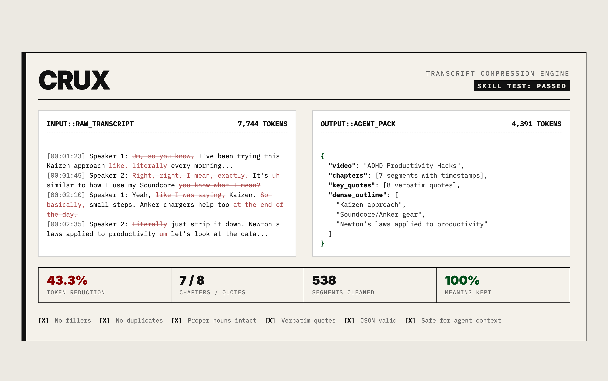

# ⚡ Crux

Crux is a transcript compression engine for AI agents. It takes messy YouTube videos or podcast transcripts, strips out the filler words and false starts, and packages the core meaning into a dense JSON/Markdown file designed to drop straight into an LLM context window.



---

## Quick start

### 1. Install dependencies

```bash
pip install youtube-transcript-api tiktoken
```

### 2. Fetch a transcript

```bash
python scripts/fetch_transcript.py "https://youtube.com/watch?v=VIDEO_ID" -o raw.txt
```

### 3. Auto-compress (first pass)

```bash
python scripts/compress_transcript.py raw.txt -o compressed.txt
```

You'll see a report like:

```
──────────────────────────────────────────────────
  Transcript Compression Report
──────────────────────────────────────────────────
  Method:          tiktoken (cl100k_base)
  Before:            12,847 tokens
  After:              9,231 tokens
  Reduction:          28.1%
  Characters:        51,388 →     36,924
──────────────────────────────────────────────────
  ⚠  This is an automated first pass.
  The agent should further compress by removing
  duplicate ideas and segmenting into chapters.
──────────────────────────────────────────────────
```

### 4. Let the agent finish the job

Provide the raw or auto-compressed transcript to the agent with this skill active. It will:

1. Apply the full cleaning rules from [`references/keep_vs_cut.md`](references/keep_vs_cut.md)
2. Segment into chapters with timestamps
3. Extract the best verbatim quotes
4. Produce the final **Crux Pack** — a single Markdown doc with embedded JSON

---

## What's in the box

```
crux/
├── SKILL.md                          # Agent instructions
├── README.md                         # You are here
├── scripts/
│   ├── fetch_transcript.py           # Pull transcripts from YouTube
│   └── compress_transcript.py        # Automated first-pass compression
└── references/
    └── keep_vs_cut.md                # What to preserve vs. remove
```

---

## Output format

The final transcript pack is a Markdown document containing:

| Section | Purpose |
|---|---|
| **Header** | Title, source, duration, speakers, token reduction stats |
| **Summary** | 2–5 sentence overview |
| **Chapters** | Timestamped sections with compressed text |
| **Key Quotes** | 5–15 verbatim quotes with attribution |
| **Dense Outline** | Hierarchical bullet-point outline |
| **JSON block** | Machine-readable structured data (collapsible) |

The output is designed to be **pasted directly into another agent's context** as compact, faithful source material.

---

## Design decisions

- **Rule-based first pass + agent refinement.** The Python scripts handle mechanical cleanup (filler words, whitespace). The agent handles judgment calls (de-duplication, chapter boundaries, quote selection). Best of both worlds.
- **Verbatim quotes from the original.** Quotes are pulled from the *raw* transcript, not the compressed version, so they're genuinely verbatim.
- **Dual format output.** Markdown for humans, JSON for machines — in the same document.
- **Token counting built in.** Every pack reports its compression ratio. You always know how much context budget you're saving.

---

## Tips

- For videos without auto-captions, paste the transcript manually — the skill handles all three input types.
- The `--json` flag on `fetch_transcript.py` gives you raw segments with start/duration if you want to build your own pipeline.
- The compression script works on **any** transcript, not just YouTube — pipe in podcast transcripts, meeting notes, etc.
